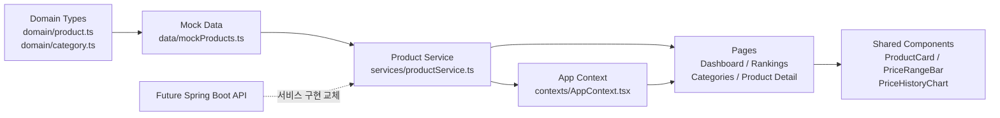

# PricePulse


PricePulse는 GPU, CPU, 노트북의 가격 흐름을 비교해 구매자와 판매자가 현재 가격 수준과 적정 거래 구간을 판단하도록 돕는 프런트엔드 데모입니다.

현재 버전은 실제 판매처 API나 크롤러를 사용하지 않습니다. 화면에 표시되는 가격과 가격 이력은 서비스 시연을 위한 목업 데이터입니다.

## 주요 기능

- GPU 10개, CPU 9개, 노트북 9개의 데모 상품 제공
- 최근 6개월 가격 변동폭 TOP 10
- 최저가 근접 상품 탐색
- 카테고리별 가격 흐름 요약
- 카테고리 필터, 정렬, 페이지 번호 방식의 전체 순위
- 가격 범위와 현재 가격 위치 시각화
- Recharts 기반 가격 이력 차트
- 구매자와 판매자 관점의 적정 거래 가격 안내
- 라이트·다크 테마와 사용자 선택 저장
- MP4 기반 전체 화면 인트로와 접근성 fallback
- 데스크톱, 태블릿, 모바일 반응형 레이아웃

## 기술 스택

| 영역             | 기술                                  |
| ---------------- | ------------------------------------- |
| UI               | React 19, TypeScript                  |
| 빌드             | Vite 7, esbuild                       |
| 스타일           | Tailwind CSS 4, CSS Custom Properties |
| 라우팅           | wouter                                |
| 차트             | Recharts                              |
| UI 기반 컴포넌트 | Radix UI                              |
| 아이콘           | Lucide React                          |
| 서버             | Express 정적 배포 서버                |
| 패키지 관리자    | pnpm                                  |

## Architecture

PricePulse는 화면 컴포넌트가 목업 파일을 직접 읽지 않도록 도메인, 데이터, 서비스, UI 계층을 분리합니다.



### 계층별 책임

#### Domain

- `ProductCategory`: 현재 노출하는 `GPU`, `CPU`, `LAPTOP` 식별자
- `Product`: 상품 기본 정보, 가격 요약, 적정 가격 범위, 가격 이력
- `PriceHistoryPoint`: 날짜별 가격
- `PriceStatus`: 최저가 근접부터 최고가 근접까지의 텍스트 상태
- `PriceSummary`, `FairPriceRange`: 향후 API DTO 분리에 사용할 가격 정보

가격 변동폭, 현재 위치, 최저가 차이, 평균 가격과 가격 상태는 목업 seed에 중복 저장하지 않고 데이터 생성 과정에서 계산합니다.

#### Data

`client/src/data/mockProducts.ts`가 28개 데모 상품과 서로 다른 가격 이력을 생성합니다.

상품 가격은 특정 판매처의 실제 가격을 의미하지 않으며, 실제 거래 가격이나 가격 예측을 보장하지 않습니다.

#### Service

`client/src/services/productService.ts`가 UI에서 사용하는 데이터 접근 경계를 제공합니다.

- `getProducts()`
- `getProductsByCategory(category)`
- `getTopPriceRangeProducts(limit)`
- `getNearLowestPriceProducts(limit)`
- `getProductById(id)`
- `getRelatedProducts(product, limit)`
- `getCategorySummary(category)`
- `sortProducts(products, sort)`

향후 Spring Boot API를 연결할 때 이 서비스의 구현을 HTTP 기반 비동기 함수로 교체하고, 페이지와 공용 컴포넌트는 기존 `Product` 도메인을 계속 사용합니다.

#### Application State

`AppContext`는 상품 데이터와 인트로 표시 상태를 제공합니다.

- 인트로 완료 여부: `sessionStorage`
- 저장 키: `pricepulse-intro-seen`
- 강제 재생: `?showIntro=true`
- 인트로 활성 중 메인 UI는 `inert` 및 `aria-hidden` 처리

테마는 별도 `ThemeContext`에서 관리하며 `html[data-theme]`, CSS 변수, `localStorage`의 `pricepulse-theme` 값을 동기화합니다.

#### UI

페이지는 데이터 선택과 화면 구성을 담당하고, 상품 표현은 공용 컴포넌트로 분리합니다.

- `ProductCard`: 상품 요약, 가격 상태, 가격 범위, 상세 링크
- `PriceRangeBar`: 최저가·적정 범위·최고가와 현재 위치
- `PriceHistoryChart`: 스카이 블루 가격선과 주황색 현재 가격점
- `AmbientPriceSignalCanvas`: 메인 Hero의 자동 이동·포인터 반응형 배경
- `IntroVideo`: 영상 재생, HTML 메시지, skip, fallback과 cleanup

## 프로젝트 구조

```text
client/
├── public/
│   ├── images/categories/       # 내부 카테고리 대표 SVG
│   └── videos/                  # 인트로 MP4
└── src/
    ├── components/
    │   ├── intro/               # 영상 인트로와 레이어
    │   └── ui/                  # Radix 기반 UI primitives
    ├── contexts/                # 앱 상태와 테마
    ├── data/                    # 데모 목업 데이터
    ├── domain/                  # Product와 Category 타입
    ├── lib/                     # 포맷팅, 페이지네이션, Canvas 엔진
    ├── pages/                   # 라우트 단위 화면
    ├── services/                # 상품 데이터 접근 계층
    ├── App.tsx                  # Provider와 라우팅
    └── index.css                # 테마 토큰과 전역 스타일
server/
└── index.ts                     # 프로덕션 정적 파일 서버
```

## 라우팅

| 경로                       | 화면                                                        |
| -------------------------- | ----------------------------------------------------------- |
| `/`                        | Hero, 카테고리 바로가기, TOP 10, 최저가 근접, 카테고리 요약 |
| `/rankings`                | 전체 상품 순위, 카테고리 필터, 정렬, 페이지네이션           |
| `/categories?category=GPU` | 선택 카테고리의 요약과 상품 목록                            |
| `/products/:id`            | 가격 범위, 가격 이력, 구매자·판매자 관점, 관련 상품         |
| `/safe-trade`              | 적정 거래 가격 판단 방식 안내                               |

전체 순위 query 예시:

```text
/rankings?category=GPU&sort=range&page=1
```

지원 정렬:

- `range`: 가격 변동폭 큰 순
- `price-asc`: 현재 가격 낮은 순
- `price-desc`: 현재 가격 높은 순
- `near-low`: 최저가 근접 순

## 로컬 실행

Node.js와 pnpm이 필요합니다.

```bash
pnpm install --frozen-lockfile
pnpm run dev
```

Vite 개발 서버가 출력한 로컬 주소로 접속합니다.

인트로를 다시 확인하려면 다음 query를 사용합니다.

```text
http://localhost:3000/?showIntro=true
```

## 검증과 빌드

```bash
# TypeScript 검사
pnpm run check

# 프런트엔드와 Express 서버 프로덕션 빌드
pnpm run build

# 빌드 결과 실행
pnpm run start

# Vite 프리뷰
pnpm run preview
```

현재 `package.json`에는 별도의 lint 또는 test 스크립트가 정의되어 있지 않습니다.

## 가격 계산 기준

```ts
priceRangeAmount = sixMonthHighPrice - sixMonthLowPrice;

priceRangeRate =
  sixMonthLowPrice > 0 ? (priceRangeAmount / sixMonthLowPrice) * 100 : 0;

currentPositionRate =
  priceRangeAmount > 0
    ? ((currentPrice - sixMonthLowPrice) / priceRangeAmount) * 100
    : 50;

lowestPriceDifferenceRate =
  sixMonthLowPrice > 0
    ? ((currentPrice - sixMonthLowPrice) / sixMonthLowPrice) * 100
    : 0;
```

최저가 근접 상품은 다음 조건으로 선택합니다.

```ts
currentPrice <= sixMonthLowPrice * 1.1;
```

가격 범위 마커는 UI에서 0~100% 사이로 제한합니다.

## 정적 리소스와 성능

- 상품 이미지는 외부 URL 대신 내부 SVG를 사용합니다.
- 인트로 영상은 JavaScript에 import하지 않고 `/videos/pricepulse-intro.mp4` 정적 경로로 제공합니다.
- 인트로 종료 후 video를 정지하고 컴포넌트를 unmount합니다.
- 모바일과 `prefers-reduced-motion`에서는 인트로 fallback과 효과 축소 정책을 적용합니다.
- 메인 Canvas는 인트로 중 실행하지 않고, 메인 화면 활성 후 하나의 animation loop만 사용합니다.

## 현재 범위에서 제외된 기능

- 실제 상품 검색
- 로그인과 사용자 계정
- 관심 상품과 가격 알림
- 실제 결제, 에스크로, 판매 등록
- 외부 가격 API
- 크롤링과 배치 수집
- 사용자 가격 입력 체험

## 향후 확장

- Spring Boot 상품·가격 이력 API 연결
- 메모리, 메인보드, SSD, 모니터 카테고리 추가
- 승인된 모델별 상품 이미지 관리
- API 응답 캐시와 로딩·오류 상태
- 자동화 테스트와 접근성 회귀 테스트
- Recharts와 메인 번들의 추가 코드 분할
